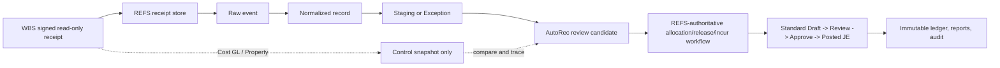

# WBS Finance to Auto Bank Reconciliation implementation boundary

## Purpose

This document defines how existing WBS Finance & Accounting data enters REFS
without reproducing WBS write operations. It is the implementation boundary for
the WBS Payable Report, Bank Transaction Journal Entries, Auto Bank
Reconciliation detail, Cost General Ledger, and Property Comparison Report.

The decision and non-negotiable authority split are frozen in
[`WBS-FINANCE-AUTOREC-INGRESS-ADR.md`](WBS-FINANCE-AUTOREC-INGRESS-ADR.md).

REFS is the accounting system of record for its own workflow. WBS is a
read-only source of evidence. A WBS receipt never approves, posts, releases,
incurs, reverses, or creates a REFS journal.

## Producer classification

| WBS input | Role in REFS | Admission result | Never permitted from this input |
| --- | --- | --- | --- |
| Payable Report | Business-side transaction producer | Receipt -> Raw -> Normalized -> Staging/Exception -> review candidate | Direct Draft, release, incur, post |
| Bank Transaction Journal Entries | Bank-side transaction producer | Receipt -> Raw -> Normalized -> Staging/Exception -> review candidate | Synthetic bank transaction from a WBS journal or `cb_id` |
| AutoRec payment/released/incurred detail | Optional business-side evidence and relation evidence | Receipt -> Raw -> Normalized -> Staging/Exception -> review candidate | Treating Seq No., Ref No., batch, or `cb_id` as an immutable payment key |
| AutoRec company/bank controls | Control evidence | Receipt -> immutable control snapshot -> control reconciliation | Allocation, Draft, JE, post |
| Cost General Ledger | Control evidence | Receipt -> fourteen-metric snapshot -> control reconciliation | Source document, bank row, allocation, Draft, JE, post |
| Property Comparison Report | Control evidence | Receipt -> property/period snapshot -> control reconciliation | Source document, bank row, allocation, Draft, JE, post |
| WBS Accounting Journal / log | External trace evidence | Immutable relation receipt -> trace readback | Bank transaction creation, matching instruction, REFS posting authority |

## Canonical inbound path



The dotted control path can demonstrate a difference or reconciled control;
it cannot turn a report into a transaction.

## Transaction admission contract

A Payable, Bank Transaction, or AutoRec Detail record is admitted only when a
single receipt-bound row has all of the following:

- tenant, entity, company, ISO currency, and (for a bank-side row) bank account;
- immutable provider key and source version;
- receipt reference, storage version, payload hash, and verified signature;
- nonzero canonical amount and explicit debit/credit direction;
- valid business date and posting/accounting date;
- approved mapping snapshot and the dimensions required by that mapping.

Any missing, incompatible, or ambiguous item yields a scoped Exception. The
exception has no candidate, allocation, Draft, dispatch, or posting authority.
An absent later source row is not a deletion unless the provider supplies a
signed tombstone/CDC semantic.

### Immutable key rules

- Payable: provider payable GUID only after the receipt binds it.
- Bank Transaction: `bank_transaction_id` only after the receipt binds it.
- AutoRec Detail: `pd_guid` only after the receipt binds it.
- `cb_id`, journal number, Payable No., Ref No., Seq No., memo, batch ID, and
  display GuId are trace fields, not transaction or match keys.

## Observed AutoRec state model

The WBS UI exposes four stages: Company Screening, Data Processing & Release,
Incur, and Incurred List. REFS retains a source observation with the following
translation boundary:

| WBS observation | REFS retained fact | What it does not authorize |
| --- | --- | --- |
| Not matched payment | Unmatched bank-side evidence; a mapping/review exception until fully scoped | WBS Add/Release/Split/Set Vendor action or a REFS allocation |
| Released detail | Observed release history and relation trace | Changing REFS case state, JE creation, or posting |
| Incurred detail | Observed bank-to-AUTOC/payable relation, review/log trace | Changing REFS case state or treating WBS incurred as a Posted JE |
| M/R/C company summary | Quantity/amount/released/incurred/reconciliation-balance control evidence | Row capacity, auto-match, Draft, or post |

The WBS canonical state transition graph, cancel/reopen behavior, actor
separation, and period semantics remain **UNKNOWN** until a signed provider
contract proves them. REFS must use its own authoritative state machine.

## Matching and accounting result

The review-only matching proposal requires same company, currency, and bank
account; opposite receipt-verified directions; exact source versions; and an
approved policy with an explicit date basis:

- `BUSINESS_ONLY`
- `ACCOUNTING_ONLY`
- `BUSINESS_AND_ACCOUNTING`

The proposal may represent exact, tolerance, partial, one-to-many, or
many-to-one review relationships. It remains non-dispatchable. The REFS kernel
must recheck reservations, locking, segregation of duties, period status, and
mapping policy before it can create a standard Draft request.

For G11 accounting readback, REFS requires one POSTED `PAYABLE_INCUR` leg and
one POSTED `AUTOC` leg, exact source/receipt/mapping/ledger/audit links, and
zero net `291001` clearing by member. WBS journal data can explain this chain
but cannot replace either REFS posted leg.

## Persisted forward and reverse trace

An admitted WBS trace relation is append-only and scope-bound to the exact
REFS inbound record:

```
receipt hash + source type/key/version + company
  -> Raw/Normalized/Staging
  -> relation evidence (e.g. Payable-to-bank or bank-to-AUTOC)
  -> reviewed proposal
  -> REFS mapping / JE / ledger / audit readback
```

Relation evidence stores a separate immutable trace receipt
(`ref`, `version`, `issued_at`, manifest/content hashes, key ID and Ed25519
algorithm). It is replay-safe through a canonical hash and idempotency key.
It always returns `can_create_transaction=false`, `can_allocate=false`,
`can_create_draft=false`, and `can_post=false`.

## Control totals and golden scenarios

The twelve scenario contract is
[`contracts/wbs-autorec-golden-scenarios-v1.json`](contracts/wbs-autorec-golden-scenarios-v1.json).
It covers exact, partial, one-to-many, many-to-one, cross-company, date and
amount tolerance, duplicate replay, reopen boundary, NUL company isolation,
invalid dates, 291001 two-leg clearing, and report-as-source blocking.

For each signed provider sample, REFS must compare source and target counts,
amounts by signed direction, released/incurred control totals, exception count,
and source-to-ledger/reverse traces. A report control mismatch is a
`DIFFERENCE`, not a transaction to correct automatically.

## Production readiness gaps

The following are not yet verified with a real WBS provider response:

1. A signed, nonempty Payable, Bank Transaction, or AutoRec Detail receipt,
   including immutable key/version/replay semantics.
2. Provider definitions for Cost GL's fourteen metrics and Property Comparison
   calculation/join scope.
3. Signed WBS state transition, cancellation, reopen, and segregation-of-duty
   semantics.
4. Real WBS-to-REFS browser refresh and production receipt-store E2E evidence.

Until these items are supplied and independently validated, this is a tested
REFS integration boundary, not a production-equivalence declaration.
