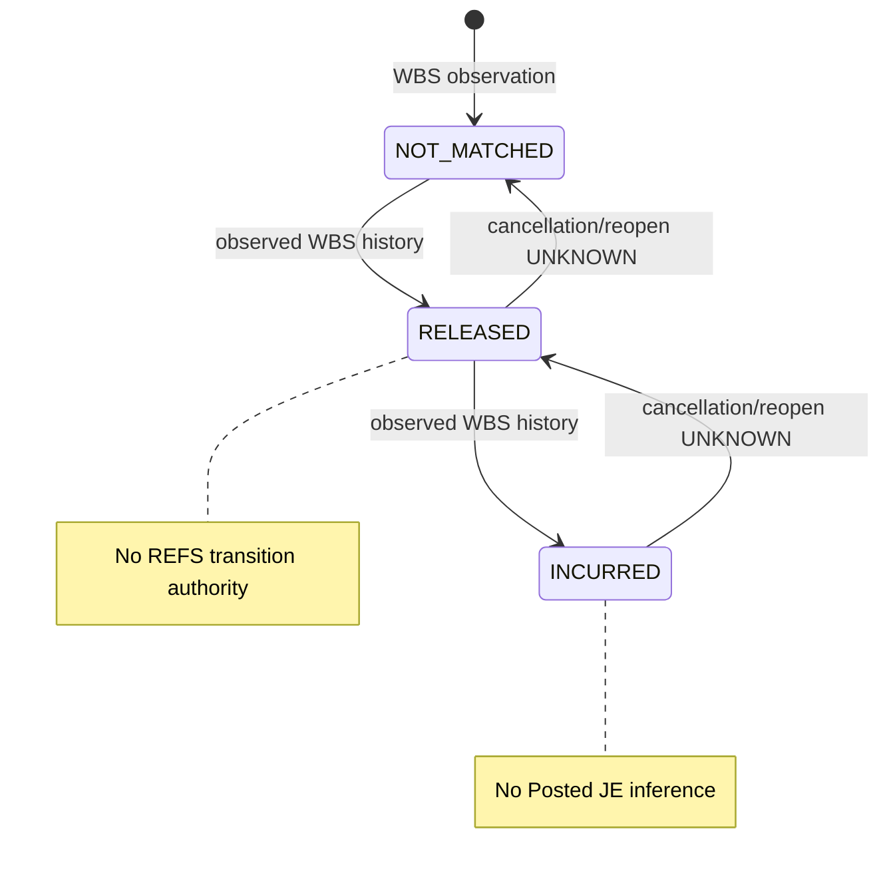

# ADR-066: WBS Finance ingress is evidence-first and REFS-authoritative

**Status:** Accepted

**Date:** 2026-08-10

**Deciders:** REFS Accounting, AutoReconciliation, and WBS Finance owners

## Context

WBS Finance & Accounting exposes Payable Report, Bank Transaction Journal
Entries, Auto Bank Reconciliation detail and company controls, Cost General
Ledger, Property Comparison Report, and accounting journal/log views. These
views do not all have the same accounting meaning: a payable or bank record may
become an evidence-backed review candidate, whereas Cost GL and Property
Comparison are reports used to test controls.

Treating all WBS rows as transactions would permit a report to create a Draft
journal, would mistake display references for immutable keys, and would let a
WBS release/incur display change REFS accounting state without REFS review,
approval, posting, or ledger evidence.

## Decision

REFS accepts WBS only through a signed, immutable, read-only receipt. It then
persists the receipt and typed Raw, Normalized, and Staging/Exception evidence
before exposing a review-only AutoRec candidate. The REFS kernel alone owns
reservation, allocation, release, incur, Draft, review, approval, post,
reversal, ledger, and audit actions.

| WBS view | Ingress classification | Required immutable facts | REFS result |
| --- | --- | --- | --- |
| Payable Report | Business-side producer | payable provider key, source version, company, currency, amount/direction, business and posting dates, approved mapping, signed receipt | Staging or scoped Exception; then review-only candidate |
| Bank Transaction Journal Entries | Bank-side producer | bank transaction key, source version, company, bank account, currency, amount/direction, dates, approved mapping, signed receipt | Staging or scoped Exception; then review-only candidate |
| AutoRec detail | Relation/business evidence | `pd_guid`, source version, company/currency, amount/direction, detail/relation receipt | Staging or scoped Exception; relation trace only until fully admitted |
| AutoRec company summary | Control evidence | company, M/R/C periods, quantity, amount, released/incurred/balance, receipt formula/hash | Append-only control snapshot; never a capacity or command |
| Cost General Ledger | Control evidence | company/period/currency, signed receipt, exactly 14 canonical metrics, approved mapping | Per-metric reconciliation and trace only |
| Property Comparison Report | Control evidence | company/property/period/currency/bank scope, signed receipt, approved mapping | Per-metric reconciliation and trace only |
| WBS accounting journal/log | External trace | receipt-bound source/relation/reference/version | Read-only supporting trace only |

`cb_id`, journal number, Payable No., Ref No., Seq No., batch ID, memo, and
display GuId are never immutable transaction or allocation keys.

## State and accounting boundaries

WBS stage labels are retained as observed evidence only:

The REFS authoritative chain is independent and cannot start without admitted
evidence: `Staging -> review proposal -> controlled allocation/reservation ->
Draft -> Review -> Approve -> Posted -> immutable ledger/audit`. A G11 result
is readable only when one posted `PAYABLE_INCUR` leg and one posted `AUTOC` leg
have the same reviewed trace and their member-level `291001` clearing net is
zero.

## Options considered

### Option A: Make all WBS Finance views transaction producers

Rejected. It would turn reports into accounting instructions and would allow
display values or a WBS workflow label to bypass REFS controls.

### Option B: Copy WBS workflow and post journals directly from ingestion

Rejected. It duplicates mutable WBS operations, violates the read-only
provider boundary, and has no REFS segregation-of-duties or ledger proof.

### Option C: Evidence-first ingress with REFS-authoritative accounting

Accepted. It preserves source lineage while keeping matching and accounting
authority in the system of record.

## Consequences

- A missing signature, immutable key/version, scope, amount/direction, date,
  or approved mapping is a scoped Exception with zero candidate, Draft,
  dispatch, or post authority.
- A later missing source row is not a deletion unless WBS provides signed CDC
  or tombstone semantics.
- Cost GL requires exactly fourteen canonical metric values at the PostgreSQL
  persistence boundary; Property metric cardinality remains mapping-defined.
- Signed nonempty production receipts, provider state/cancel/reopen semantics,
  Cost GL formulas, and Property calculation scope remain **UNKNOWN** until
  supplied and independently verified.

## Acceptance evidence

The twelve sanitized golden scenarios and their source/target totals are fixed
in `contracts/wbs-autorec-golden-scenarios-v1.json`. Every accepted production
sample must prove source receipt/key/version -> Raw -> Normalized -> Staging or
Exception -> review/mapping -> JE/ledger/audit readback, plus the reverse
trace. The complete release matrix is
`WBS-AUTOREC-EQUIVALENCE-ACCEPTANCE-MATRIX.md`.
